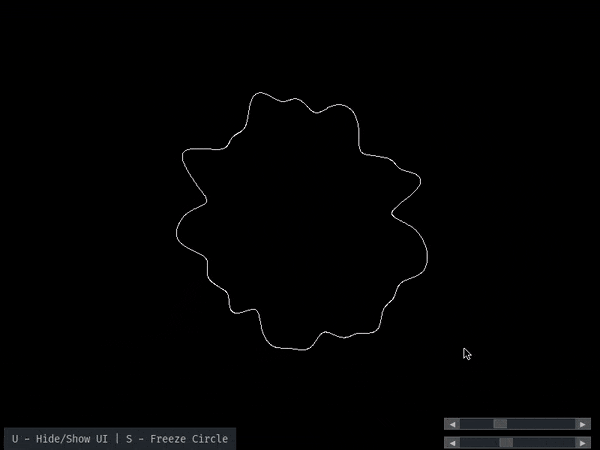

# OpenSimplexNoise Visualiser
Visualizer for some of the OpenSimplex noise done on a 2D circle with variable intensity and magnitude. 

## How to run
1. Either fork or download the repository
2. Install OpenSimplexNoise and Pygame dependencies using `npm i` command
3. Run the program

## How does it work
1. Creates a blank window
2. Starting with variable *theta* at 0 smaller than tau (2 * Math.PI), iterates through each point on a circle
3. For each point it calculates the corresponing noise value and modifies the circle
4. Finally, it draws the shape and updates it every frame

## Customisation
There are two sliders
- First slider is for *frequency* of the noise
- Second slider is for *amplitude* of the noise

## Preview

